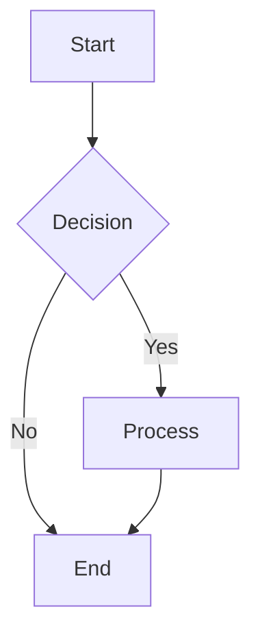

# Juizo

**Data tools for Excel** - A powerful Excel add-in that brings data transformation, visualization, and diagramming capabilities to your spreadsheets.

## Features

### 📊 Arquero Query Editor
Transform and analyze Excel table data using [Arquero](https://uwdata.github.io/arquero/), a JavaScript library for query processing and transformation of array-backed data tables.

- Write JavaScript queries directly in Excel
- Real-time preview of transformations
- Export results to new Excel tables
- Automatic query persistence per table

**Example:**
```javascript
dt.filter(d => d.Amount > 100)
  .groupby('Category')
  .rollup({ total: d => op.sum(d.Amount) })
  .orderby(aq.desc('total'))
```

### 📈 Vega-Lite Charts
Create interactive, publication-quality visualizations using [Vega-Lite](https://vega.github.io/vega-lite/), a high-level grammar of interactive graphics.

- Define charts with declarative JSON specifications
- Auto-update charts when table data changes (real-time sync)
- Save and reuse chart specifications per table
- Export charts to Excel worksheets as images

**Example Specification:**
```json
{
  "$schema": "https://vega.github.io/schema/vega-lite/v5.json",
  "mark": "bar",
  "encoding": {
    "x": {"field": "Category", "type": "nominal"},
    "y": {"field": "Amount", "type": "quantitative"}
  }
}
```

### 📐 Mermaid Diagrams
Generate flowcharts, sequence diagrams, and other diagram types using [Mermaid](https://mermaid.js.org/), a JavaScript-based diagramming tool.

- Create diagrams with simple text-based syntax
- Save diagram specifications for reuse
- Export diagrams as PNG images to Excel

**Example:**


## Installation

### Prerequisites
- Microsoft Excel (Desktop version)
- Node.js 14.x or higher
- npm 6.x or higher

### Development Setup

1. **Clone the repository:**
   ```bash
   git clone https://github.com/cbaragao/Juizo.git
   cd Juizo
   ```

2. **Install dependencies:**
   ```bash
   npm install
   ```

3. **Build the add-in:**
   ```bash
   npm run build:dev
   ```

4. **Start the development server:**
   ```bash
   npm run dev-server
   ```

5. **Sideload the add-in in Excel:**
   ```bash
   npm start
   ```
   
   Or manually sideload via Excel: **Insert > Add-ins > My Add-ins > Upload My Add-in** and select `manifest.xml`

## Usage

### Working with Arquero

1. **Create an Excel table** with your data (Insert > Table)
2. **Click any cell in the table**
3. **Open Juizo** from the Excel ribbon
4. **Click "Arquero Query"**
5. Write your transformation query using `dt` as the input table
6. **Preview** to see results
7. **Output to Excel** to create a new table with transformed data

### Creating Vega-Lite Charts

1. **Select a table** from the dropdown
2. **Write or modify** the Vega-Lite JSON specification
3. **Preview Chart** - the chart will auto-update when table data changes!
4. **Save Spec** to persist your chart
5. **Save to Worksheet** to export as an image

### Drawing Mermaid Diagrams

1. **Write Mermaid syntax** in the editor
2. **Preview** to see the rendered diagram
3. **Save Spec** to persist your diagram
4. **Save to Worksheet** to insert as an image in Excel

## Performance Optimizations

Juizo uses several techniques to ensure fast performance:

- **Columnar data loading**: Data is loaded in columnar format for 10-100x faster processing
- **Single sync operations**: Minimizes Excel API round-trips
- **Event-driven updates**: Charts auto-update only when data actually changes
- **Efficient table operations**: Direct Excel Table API usage instead of range scanning

## Project Structure

```
Juizo/
├── src/
│   └── taskpane/
│       ├── taskpane.ts       # Main TypeScript logic
│       ├── taskpane.html     # UI layout
│       └── taskpane.css      # Styling
├── assets/                   # Icons and images
├── manifest.xml              # Add-in manifest
├── package.json              # Dependencies
├── webpack.config.js         # Build configuration
└── tsconfig.json             # TypeScript configuration
```

## Scripts

- `npm run build` - Production build
- `npm run build:dev` - Development build
- `npm run dev-server` - Start dev server with hot reload
- `npm start` - Sideload add-in in Excel
- `npm run watch` - Watch mode for development

## License

MIT License

## Dependencies & Attributions

This project uses the following open-source libraries:

### Arquero
**License:** BSD 3-Clause License  
**Copyright:** Copyright (c) 2020-2024, UW Interactive Data Lab. All rights reserved.  
**Website:** https://uwdata.github.io/arquero/

Arquero is a JavaScript library for query processing and transformation of array-backed data tables.

### Vega-Lite
**License:** BSD 3-Clause License  
**Copyright:** Copyright (c) 2020-2024, UW Interactive Data Lab. All rights reserved.  
**Website:** https://vega.github.io/vega-lite/

Vega-Lite is a high-level grammar of interactive graphics. If you use Vega-Lite in published research, please cite:

```bibtex
@article{2017-vega-lite,
  doi = {10.1109/tvcg.2016.2599030},
  year = {2017},
  author = {Arvind Satyanarayan and Dominik Moritz and Kanit Wongsuphasawat and Jeffrey Heer},
  title = {Vega-Lite: A Grammar of Interactive Graphics},
  journal = {{IEEE} Transactions on Visualization \& Computer Graphics (Proc. InfoVis)},
  url = {http://idl.cs.washington.edu/papers/vega-lite},
}
```

### Mermaid
**License:** MIT License  
**Website:** https://mermaid.js.org/

Mermaid is a JavaScript-based diagramming and charting tool that uses Markdown-inspired text definitions and a renderer to create and modify complex diagrams.

---

## Contributing

Contributions are welcome! Please feel free to submit a Pull Request.

## Support

For issues and feature requests, please visit: https://github.com/cbaragao/Juizo/issues

---

**Made with ❤️ for data enthusiasts**
